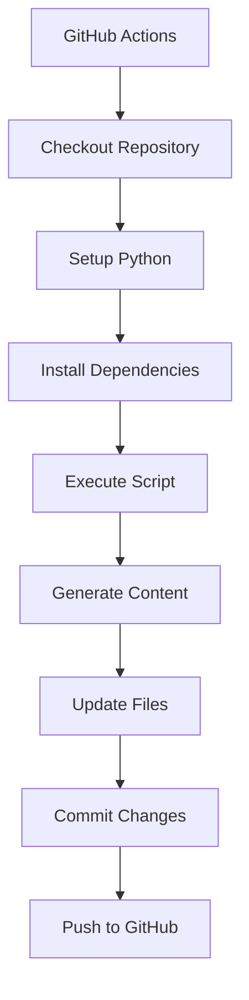

# 👨‍💻 Guide du Développeur

> **Documentation technique pour les développeurs du projet Auto-Update GitHub**

## 🏗️ Architecture Technique

### Structure du Projet

```
📁 Projet/
├── 📁 .github/workflows/          # Workflows GitHub Actions
├── 📁 scripts/                   # Scripts Python
├── 📁 data/                      # Données persistantes
├── 📁 config/                    # Configuration
├── 📄 daily-report.md            # Document généré
└── 📄 README.md                  # Documentation utilisateur
```

### Flux de Données



## 🔧 Développement Local

### Prérequis

- **Python 3.11+**
- **Git**
- **pip**

### Installation

```bash
# Cloner le repository
git clone <repo-url>
cd auto-update-github-project

# Installer les dépendances
pip install -r requirements.txt

# Tester localement
python scripts/test_local.py
```

### Structure des Scripts

#### `scripts/generate_report.py`

- **Rôle** : Script principal de génération
- **Fonctions principales** :
  - `get_current_time_info()` : Informations temporelles
  - `test_api_connection()` : Test d'API
  - `generate_report_content()` : Génération du contenu
  - `main()` : Point d'entrée

#### `scripts/test_local.py`

- **Rôle** : Tests locaux
- **Fonctions** :
  - Validation des imports
  - Test d'exécution
  - Vérification des fichiers
  - Validation du contenu

#### `scripts/validate_project.py`

- **Rôle** : Validation complète
- **Fonctions** :
  - Vérification de la structure
  - Validation des configurations
  - Tests de cohérence

## 🧪 Tests et Validation

### Tests Locaux

```bash
# Test complet
python scripts/test_local.py

# Validation du projet
python scripts/validate_project.py

# Démonstration
python scripts/demo.py
```

### Tests GitHub Actions

1. **Test manuel** : Onglet Actions > "Auto Update Daily Report" > "Run workflow"
2. **Logs** : Vérifier les logs d'exécution
3. **Résultats** : Contrôler les fichiers générés

## 🔧 Configuration Avancée

### Personnalisation du Contenu

Modifiez `scripts/generate_report.py` :

```python
def get_custom_data():
    """Récupère des données personnalisées"""
    # Votre logique ici
    return custom_data

def generate_custom_section(data):
    """Génère une section personnalisée"""
    return f"## Section Personnalisée\n{data}"
```

### Ajout d'APIs

```python
def fetch_weather_data():
    """Récupère les données météo"""
    try:
        response = requests.get(
            'https://api.openweathermap.org/data/2.5/weather',
            params={'q': 'Paris', 'appid': 'YOUR_API_KEY'}
        )
        return response.json()
    except Exception as e:
        return {'error': str(e)}
```

### Configuration des Fuseaux Horaires

Utilisez `config/timezone_config.py` :

```python
from config.timezone_config import get_cron_expression

# Pour 9h00 en France (UTC+1)
cron_france = get_cron_expression('Europe/Paris', 9)
# Résultat: '0 8 * * *' (8h UTC = 9h France)
```

## 📊 Données et Persistance

### Fichier d'Historique

`data/update_history.json` :

```json
[
  {
    "date": "2024-01-15",
    "time": "09:00:00",
    "status": "success",
    "details": "Rapport généré avec succès - API: success"
  }
]
```

### Configuration du Projet

`config/project_config.json` :

```json
{
  "project_name": "Auto-Update GitHub Project",
  "version": "1.0.0",
  "timezone": "UTC",
  "execution_hour": 9,
  "features": {
    "auto_update": true,
    "api_testing": true,
    "history_tracking": true
  }
}
```

## 🚀 Déploiement

### Déploiement Automatique

```bash
# Windows
.\deploy.ps1

# Linux/Mac
./deploy.sh
```

### Déploiement Manuel

```bash
# 1. Validation
python scripts/validate_project.py

# 2. Tests
python scripts/test_local.py

# 3. Commit
git add .
git commit -m "Update: Description des changements"
git push origin main
```

## 🐛 Débogage

### Problèmes Courants

#### 1. Workflow ne s'exécute pas

```yaml
# Vérifier la syntaxe cron
schedule:
  - cron: "0 9 * * *" # 9h00 UTC tous les jours
```

#### 2. Erreur de permissions

```yaml
# Ajouter les permissions
permissions:
  contents: write
```

#### 3. Script Python échoue

```python
# Ajouter des logs
import logging
logging.basicConfig(level=logging.INFO)
logger = logging.getLogger(__name__)

def main():
    logger.info("Début de l'exécution")
    # Votre code ici
```

### Logs et Monitoring

1. **GitHub Actions** : Repository > Actions > "Auto Update Daily Report"
2. **Logs locaux** : Exécuter `python scripts/generate_report.py`
3. **Validation** : `python scripts/validate_project.py`

## 🔄 Maintenance

### Mise à Jour des Dépendances

```bash
# Vérifier les versions
pip list --outdated

# Mettre à jour requirements.txt
pip freeze > requirements.txt
```

### Sauvegarde des Données

```bash
# Sauvegarder l'historique
cp data/update_history.json backup/
```

### Monitoring des Performances

```python
import time

def monitor_performance():
    start_time = time.time()
    # Votre code ici
    end_time = time.time()
    print(f"Temps d'exécution: {end_time - start_time:.2f}s")
```

## 📚 Ressources

### Documentation Externe

- [GitHub Actions](https://docs.github.com/en/actions)
- [Python Requests](https://requests.readthedocs.io/)
- [Cron Expressions](https://crontab.guru/)

### Outils de Développement

- **IDE** : VS Code, PyCharm
- **Git** : GitHub Desktop, GitKraken
- **Testing** : pytest, unittest

## 🤝 Contribution

### Workflow de Contribution

1. **Fork** le repository
2. **Créer** une branche feature
3. **Développer** les fonctionnalités
4. **Tester** localement
5. **Valider** avec `validate_project.py`
6. **Commit** et push
7. **Créer** une Pull Request

### Standards de Code

- **PEP 8** pour Python
- **Docstrings** pour toutes les fonctions
- **Tests** pour les nouvelles fonctionnalités
- **Documentation** mise à jour

### Review Process

1. **Validation automatique** des tests
2. **Review** du code par les maintainers
3. **Tests** d'intégration
4. **Déploiement** après approbation

---

**🎯 Objectif** : Maintenir un projet robuste, testé et documenté pour l'auto-mise à jour de documents GitHub.
